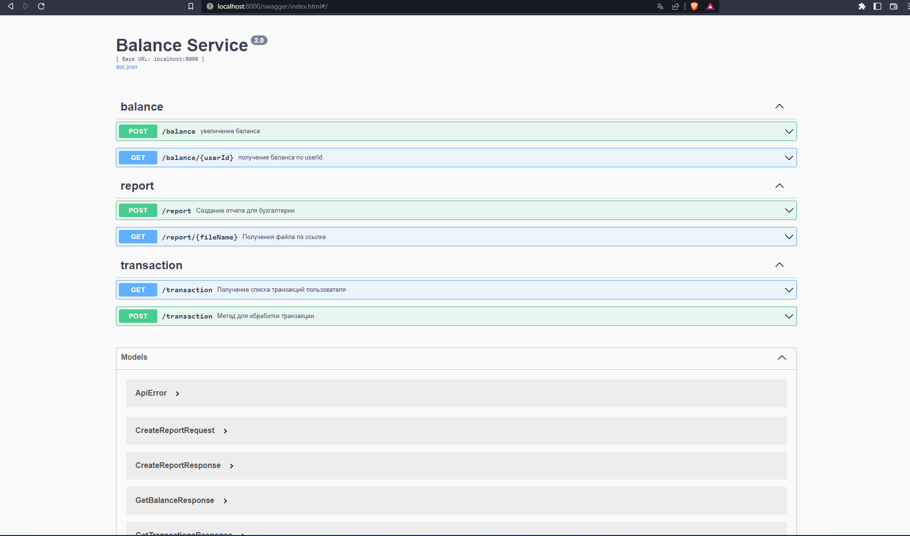

### Запуск сервера

1. Запустить базу в докере 
```text
docker-compose up
```

2. Подключиться к базе (креды в docker-compose.yml). Заполнить базу выполнив последовательно скрипты из [sql файла](init_db.sql)
3. Подтянуть необходимые зависимости
4. Запустить main функцию в [файле](cmd/main.go)

### Описание API
Доступно по ссылке:
```text
http://localhost:8000/swagger/index.html
```



### Используемые сторонние библиотеки
1. [gorilla/mux](https://github.com/gorilla/mux) - http - роутер
2. [logrus](https://github.com/sirupsen/logrus) - логирование
3. [swaggo/swag](https://github.com/swaggo/swag) - генерация swagger через аннотации
4. [go-playground/validator](https://github.com/go-playground/validator) - валидация
5. [jackc/pgx](https://github.com/jackc/pgx) - работа с бд