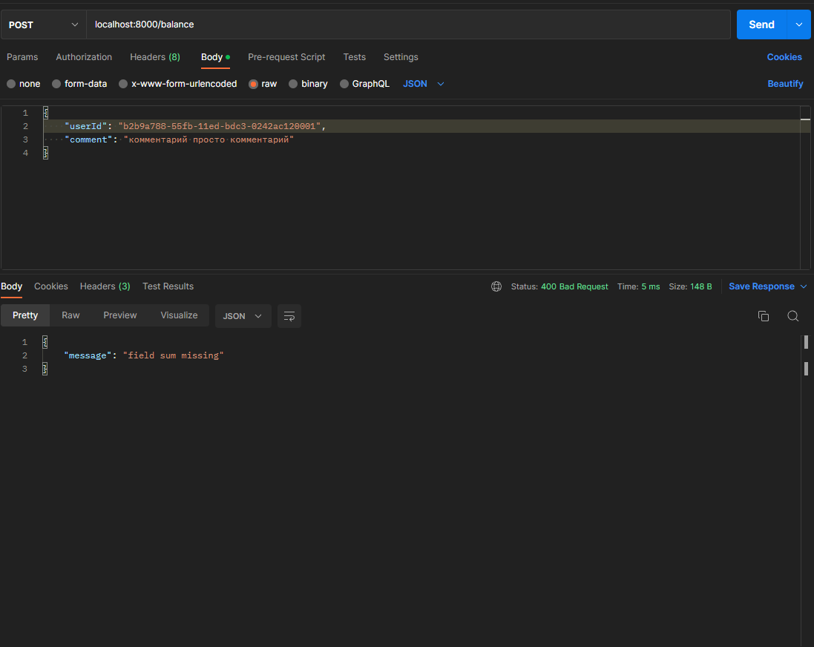

* [Запуск сервера](#запуск-сервера)
* [Описание API](#описание-API)
* [Структура БД](#структура-БД)
* [Вопросы и ответы ВАЖНО!](#вопросы-возникшие-в-ходе-разработки-и-их-решения)
* [Примеры работы сервера](#примеры-работы-сервера)
* [Используемые сторонние библиотеки](#используемые-сторонние-библиотеки)
* [Тестирование](#тестирование)

# Запуск сервера

1. Запустить базу в докере 
```text
docker-compose up
```

2. Подключиться к базе (креды в docker-compose.yml). Заполнить базу выполнив последовательно скрипты из [sql файла](init_db.sql)
3. Подтянуть необходимые зависимости
4. Запустить main функцию в [файле](cmd/main.go)

P.S. я удалял локально папку проекта и базу из докера, заново клонировал и запускал базу, все должно работать.

# Описание API
Доступно по ссылке:
```text
http://localhost:8000/swagger/index.html
```


# Структура БД
Таблица **balance** - хранение актуального баланса пользователя
```sql
create table public.balance(
user_id uuid           not null
   primary key,
balance numeric(16, 6) not null
);
```

Таблица **transaction_type** - классификатор типов транзакций
```sql
create table public.transaction_type(
id   smallint     not null
    primary key,
type varchar(100) not null
);
```

Таблица **transaction** - хранение транзакций проведенных с балансом
```sql
create table public.transaction(
id                  uuid default gen_random_uuid() not null
primary key,
order_id            uuid,
user_id             uuid                           not null,
service_id          uuid,
transaction_type_id smallint                       not null,
sum                 numeric(16, 4)                 not null,
comment             varchar,
upd_time            timestamp                      not null
);
```

Таблица **transaction_upd** - хранение истории изменений статуса транзакци1
```sql
create table public.transaction_upd(
upd_id              uuid default gen_random_uuid() not null
primary key,
id                  uuid                           not null,
order_id            uuid,
user_id             uuid                           not null,
service_id          uuid,
transaction_type_id smallint                       not null,
sum                 numeric(16, 4)                 not null,
comment             varchar,
upd_time            timestamp                      not null
);
```

# Вопросы возникшие в ходе разработки и их решения
1. До скольки знаков после запятой округлять значения денежных средтв.

**Решение**: я округлил  до 6 (на уровне бд numeric(16, 4)), то есть в случае переполнения будет округляться по математическим правилам. Вообще если брать российскую валюту, то минимальная денежная единица - 1 копейка. Соответственно хватило бы 2 знаков после запятой, но я сделал 6 на всякий случай.

2. Какими типами должны быть id-шники (userId, serviceId, orderId).

**Решение**: Вообще для небольших проектов в небольших компаниях достаточно было бы использовать int или bigint. Но так как это тест в авито, то может не хватить в определенный момент, поэтому нормальной практикой было бы сделать uuid.

3. Реализация обработки транзакций.

**Решение**: Вообще в задании было сказано так "Метод резервирования средств с основного баланса на отдельном счете. Принимает id пользователя, ИД услуги, ИД заказа, стоимость. Метод признания выручки – списывает из резерва деньги, добавляет данные в отчет для бухгалтерии.". Мне показалось странным вот что:
* Почему для метода признания выручки мы опять должны передавать id-шники и сумму. Можно было бы после резервирования средств возвращать id транзакции и в дальнейшем для ее подтверждения или отмены просто посылать этот id-шники с типом подтвердить или отклонить и вернуть средства. Но так как так было сказано в задании, то я сделал так. Но при признании выручки я не сверяю сумму что была при резервации (я просто ориентируюсь по id-шникам юзера, заказа и услуги)
* Надо было реализовать отмену транзакций, я сделал резервацию, подтверждения и отмену в 1 методе, в тело запроса просто передаю тип транзакции.
* Так же может быть ситуация, при ошибочном списании денег у пользователя (ошибочная транзакция), надо вернуть ему деньги на счет. Но я специально заблокировал возможность изменять статус транзакции в моем post методе, если она уже зафиксирована как оплачена или отклонена. Считаю что для случаев когда пользователю надо вернуть деньги, нужно делать отдельный API-метод, что будет гарантировать что мы его используем целенаправленно для отмены подтвержденной транзации.

4. Генерация отчета для бухгалтерии.

**Решение**: Так как у меня не было названий услуг, то в отчете я вывожу просто id-шники услуг и выручку за них за конкретный месяц.

# Примеры работы сервера
1. Добавление денег на баланс

Невалидный запрос:

Валидный запрос:


2. Получение баланса пользователя

Невалидный запрос:


Баланс не найден по ID (баланса для такого пользователя нет):


Все ок:


3. Транзакции

Невалидный запрос:


Попытка резервации денег с баланса пользователя (статус 3 - не достаточно денег на балансе, все статус описаны в сваггере).


Резервация прошла успешно:


Признание выручки:


4. Получения списка транзакций пользователя (можно настроить сортировку и пагинацию)


5. Создание месячного отчета для бухгалтерии (файлы создаются внутри проекта в папке static/file)

Невалидный запрос:


Валидный запрос:


6. Получения файла отчета


# Используемые сторонние библиотеки
1. [gorilla/mux](https://github.com/gorilla/mux) - http - роутер
2. [logrus](https://github.com/sirupsen/logrus) - логирование
3. [swaggo/swag](https://github.com/swaggo/swag) - генерация swagger через аннотации
4. [go-playground/validator](https://github.com/go-playground/validator) - валидация
5. [jackc/pgx](https://github.com/jackc/pgx) - работа с бд

# Тестирование

тесты написать не успел уже дедлайн, тестировал только вручную через postman.